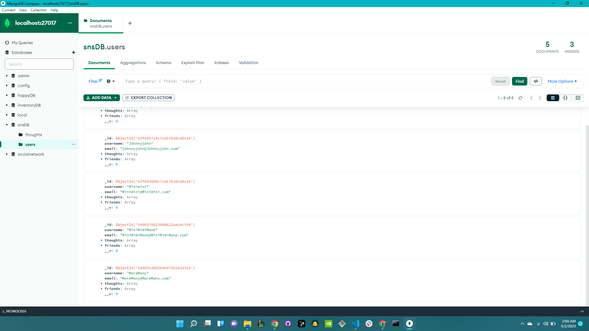
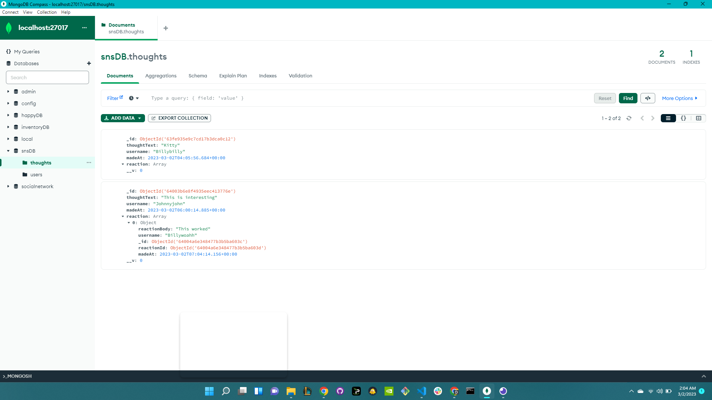

# Mys-SNS-API

 ## License

          
## Table of Content 
- [Project Description](#Description)
- [Usage](#Usage)
- [Contribution](#Contribution)
- [Installation](#Installation)
- [Tests](#Tests)
- [Questions](#Questions)
- [Email](#Email)
- [Github](#Github)
## Description
This API was created for social media networking usage through MongoDB and Insomnia or Postman. This can be used to create new users, update, delete,and find users easily. The added users can also add, remove, update, find and delete thoughts as well as add or delete reactions. Friends list coming soon.

## Usage
- Open terminal and run npm start
- Have your MongoDB connected

## Contributing
Tiffany Anglero

## Installation
User will need to install npm inquirer using the terminal on Vscode, download MongoDB and insomnia or postman. 

## Tests
run node index.js

## Questions 
Contact

Email: tiffanyanglero94@hotmail.com

GitHub: https://github.com/https://github.com/tanglero4?tab=repositories   
